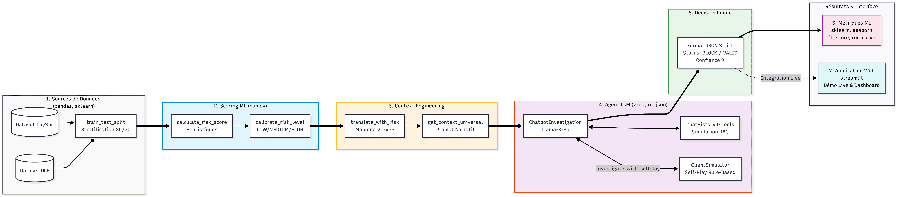

# 🛡️ CCFD Investigation Chatbot — Dialogue LLM pour la Détection de Fraude

> **Projet Master S3 · Sécurité des Transactions Électroniques et Détection de Fraudes**  
> Context Engineering + LLM pour la détection de fraude cartes bancaires  
> *Chatbot d'investigation CCFD : dialogue intelligent + contexte dynamique*

---

## 📌 Problématique

Comment créer un LLM conversationnel qui, en dialogue interactif, utilise un **contexte dynamique** pour poser les bonnes questions et converger vers une décision de fraude/légitime ?

---

## 🌟 Fonctionnalités Clés de l'Application

Notre application, développée avec Streamlit, se divise en deux parties majeures :

### 1. 💬 Mode Interactif : "Investigation Live"
Prenez la place du client ! Le Chatbot joue le rôle de l'analyste antifraude et vous interroge en temps réel sur une transaction suspecte de votre compte. 
- **Contexte Dynamique :** À chaque tour de dialogue, l'IA accumule vos réponses, ajuste la probabilité de fraude en temps réel et met à jour son contexte.
- **Jauge de Risque Visuelle :** Suivez l'impact de vos réponses. Des badges verts (signaux légitimes) et des badges rouges (signaux frauduleux) s'ajoutent dynamiquement sur le côté gauche de l'écran.
- **Le Verdict :** Après un nombre maximum de 6 questions, le LLM tranche : `FRAUDE` ou `LÉGITIME`, avec une justification argumentée.

### 2. 📖 Historique d'Investigation (Tab Live)
Cette section permet de revivre les investigations précédentes que vous avez menées avec le Bot.
- **Sauvegarde persistante :** Toutes les sessions sont sauvegardées en JSON.
- **Filtres de recherche :** Retrouvez une enquête spécifique en fonction de la "Source" (PaySim ou ULB) ou du niveau de "Risque Initial".
- **Visualisation Détaillée :** Vous pouvez ouvrir un rapport complet détaillant la conversation exacte et le verdict final qui a été rendu.

### 3. 🤔 L'Ingénierie Contextuelle et "Le Garde-fou"
Pour éviter les hallucinations du modèle LLM :
- Nous traduisons numériquement les données complexes (Context Engineering) en texte narratif.
- L'algorithme calcule d'abord un score de probabilité brut (Low, Medium, High). Ce score dicte au Bot si la transaction est intrinsèquement dangereuse, l'empêchant d'être trop facilement influencé par un manipulateur.

---

## 🔄 Workflow du Projet



---

## 🏗️ Architecture du Projet

```text
projet_chatbot_antifraude/
│
├── data/                              # Datasets et sauvegardes
│   ├── context_examples_with_risk.csv # Transactions exemples pour l'UI
│   ├── test_ulb_LOCKED_with_risk.csv  # Jeu de test ULB (Calibration)
│   ├── test_paysim_LOCKED_with_risk.csv # Jeu de test PaySim (Calibration)
│   ├── live_history.json              # Historique des sessions utilisateur
│   └── metadata.json                  # Métadonnées et descriptions
│
├── docs/                              # Documentation technique et rapports
│   ├── PLAN_DEVELOPPEMENT.md          # Chronologie détaillée du projet
│   ├── Rapport_AMBDULGHAFFAR... .pdf  # Rapport final de Master
│   ├── rapport.tex                    # Source LaTeX du rapport
│   └── presentation_summary.txt       # Script de présentation orale
│
├── results/                           # Logs et performances (Semaine 3)
│   ├── log_s3_1.json ... log_s3_30.json # 30 enquêtes de production massives
│   └── metriques_semaine3.json        # Résultats statistiques (Rappel, etc.)
│
├── src/                               # Backend Python (Cœur cognitif)
│   ├── llm_client.py                  # Client API Groq (Llama 3-70B)
│   ├── context_manager.py             # Moteur de Context Engineering
│   ├── chatbot.py                     # Agent d'investigation principal
│   ├── chat_history.py                # Gestionnaire de mémoire courte
│   └── __init__.py
│
├── web_app/                           # Interface Utilisateur (Frontend)
│   └── app.py                         # Application Streamlit Dashboard & Live
│
├── notebook96abd24326.ipynb           # Pipeline Kaggle (Cleaning & Scoring)
├── workflow_projet.png                # Schéma du workflow projet
├── .env                               # Variables d'environnement (Clé API)
├── requirements.txt                   # Dépendances du projet
└── README.md                          # Documentation principale
```

---

## 🚀 Installation & Lancement

Ce projet utilise **Streamlit** pour l'interface UI et **l'API Groq** pour faire tourner le LLM (Llama 3) ultra-rapidement.

### 1. Prérequis
- Avoir Python 3.10 ou supérieur installé.
- Avoir un compte sur [Groq Cloud](https://console.groq.com) pour obtenir une clé API gratuite.

### 2. Cloner le repo
Ouvrez un terminal et clonez le projet sur votre machine locale :
```bash
git clone https://github.com/Ambdulghaffar/ccfd-investigation-chatbot.git
cd ccfd-investigation-chatbot
```

### 3. Installer les dépendances
Installez les librairies requises via pip :
```bash
pip install -r requirements.txt
```
*(Optionnel mais recommandé : effectuez cela dans un environnement virtuel `venv`)*

### 4. Configurer la clé API Groq
Le Chatbot a besoin de se connecter à l'intelligence artificielle. Créez un fichier `.env` à la racine du projet (exactement là où se trouve ce README) et collez le contenu suivant :
```env
# Clé API générée sur la console Groq
GROQ_API_KEY=votre_cle_api_groq_ici

# Configurations du modèle
LLM_MODEL=llama3-70b-8192
MAX_QUESTIONS=6
```

### 5. Lancer l'application
Le point d'entrée du projet se trouve dans le dossier `web_app`. Lancez la commande suivante :
```bash
streamlit run web_app/app.py
```
> 🎉 **C'est prêt !** Un lien local (généralement `http://localhost:8501/`) va s'afficher dans votre console. Cliquez dessus pour ouvrir l'application dans votre navigateur.

---

## 📈 Résultats et Statistiques (Évaluation Notebook)

Pour juger efficacement notre module sans intervention humaine, nous avons généré un agent "ClientSimulator" afin de jouer 30 enquêtes automatiques (Bot VS Bot).

| Métrique | Valeur |
|----------|--------|
| Accuracy (Exactitude globale) | 66.7% |
| Precision (Transactions bloquées justement) | 61.9% |
| **Recall (Sensibilité à la fraude)** | **86.7%** |
| F1 Score | 72.2% |
| Questions moyennes par investigation | 2.7 questions |
| Confiance moyenne | 81% ! |

> 💡 **Le Biais Sécuritaire :** Le *recall très élevé* (13 fraudes trouvées sur 15) indique que le modèle penche vers une attitude prudente de 'blocage préventif' (FRAUDE) en cas de doutes sur le client. Ce trait comportemental le rend très robuste face à l'ingénierie sociale !

---

## 🗂️ Ressources et Datasets

- **Credit Card Fraud Detection (ULB)** — [Lien Kaggle](https://www.kaggle.com/datasets/mlg-ulb/creditcardfraud)  
- **Synthetic Financial Datasets (PaySim)** — [Lien Kaggle](https://www.kaggle.com/datasets/ealaxi/paysim1)  

Le code expérimental, le nettoyage des données et les calculs statistiques Sont situés sur notre notebook Kaggle :
🔗 **[Voir le notebook complet sur Kaggle](https://www.kaggle.com/code/ambdulghaffrar/notebook96abd24326/notebook?scriptVersionId=312502267)**

---

## 👤 Informations Étudiant

**Étudiant :** Ambdulghaffar Ahamadi  
**Professeur Encadrant :** Naoufal Rtayli  
**Module :** Sécurité des Transactions Électroniques et Détection de Fraudes (Master S3)  

> Modèle de fondation utilisé : Llama 3 (Meta) / API : Groq
